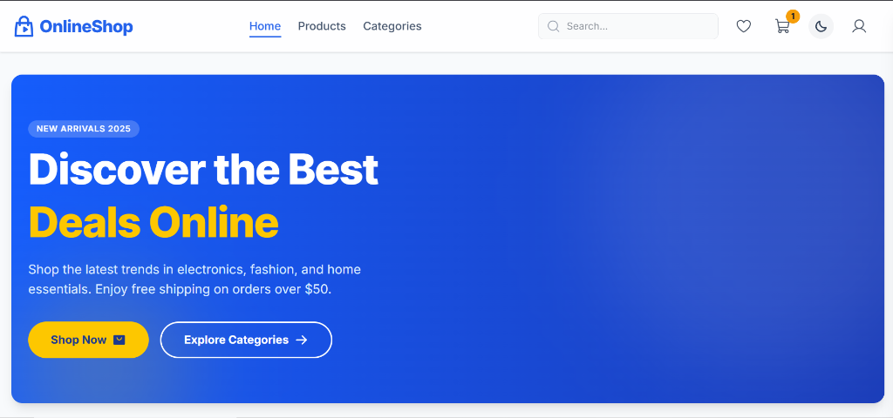
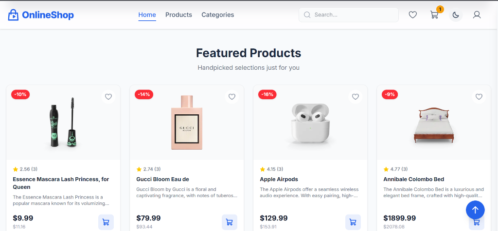

# 🛒 OnlineShop

A modern, full-featured e-commerce web application built with React 19 and Firebase. Features a sleek UI with dark mode support, real-time cart synchronization, wishlist functionality, and a complete admin dashboard.

[](https://ecommerce-store-db-52fe9.web.app/)
[](https://react.dev/)
[](https://tailwindcss.com/)
[](https://firebase.google.com/)

---

## 🌐 Live Demo

**👉 [https://ecommerce-store-db-52fe9.web.app/](https://ecommerce-store-db-52fe9.web.app/)**

---

## 📸 Screenshots

### Homepage


### Featured Products


---

## ✨ Features

### 🛍️ Shopping Experience
- **Product Browsing** - Browse products with infinite scroll pagination
- **Advanced Filtering** - Filter by category, price range, and rating
- **Smart Search** - Search products with debounced API calls
- **Product Details** - View detailed product info with image gallery
- **Reviews System** - Read and submit product reviews with star ratings

### 🛒 Cart & Checkout
- **Shopping Cart** - Add, remove, and update quantities
- **Cloud Sync** - Cart automatically syncs to Firebase for logged-in users
- **Wishlist** - Save products for later with cloud persistence
- **Secure Checkout** - Complete order flow with address and payment forms

### 👤 User Features
- **Authentication** - Login and Register with Firebase Auth
- **User Profile** - View and edit profile information
- **Order History** - Track past orders

### 🔐 Admin Dashboard
- **Dashboard Overview** - Analytics and quick stats
- **Product Management** - Add, edit, and delete products
- **Order Management** - View and manage customer orders
- **User Management** - View registered users

### 🎨 UI/UX
- **Dark/Light Theme** - Toggle between themes with persistent preference
- **Responsive Design** - Optimized for mobile, tablet, and desktop
- **Smooth Animations** - Powered by Framer Motion
- **Toast Notifications** - Real-time feedback with React Hot Toast
- **Skeleton Loading** - Elegant loading states for better UX
- **Offline Banner** - Notifies users when offline

---

## 🛠️ Tech Stack

| Category | Technology |
|----------|------------|
| **Frontend** | React 19, React Router 7 |
| **State Management** | Redux Toolkit, RTK Query |
| **Styling** | TailwindCSS 4 |
| **Animations** | Framer Motion |
| **Backend/Database** | Firebase (Firestore, Auth, Hosting) |
| **Icons** | Phosphor React |
| **Build Tool** | Vite 7 |
| **Notifications** | React Hot Toast |

---

## 📁 Project Structure

```
src/
├── api/              # RTK Query API definitions
├── app/              # Redux store configuration
├── assets/           # Static assets (images, fonts)
├── components/       # Reusable UI components
│   ├── admin/        # Admin panel components
│   ├── auth/         # Authentication guards
│   ├── cart/         # Cart-related components
│   ├── checkout/     # Checkout forms
│   ├── home/         # Homepage sections
│   ├── product-detail/  # Product detail components
│   ├── products/     # Product listing components
│   ├── profile/      # User profile components
│   ├── shared/       # Shared/common components
│   ├── skeletons/    # Loading skeleton components
│   └── ui/           # UI primitives
├── features/         # Redux slices
│   ├── auth/         # Authentication state
│   ├── cart/         # Cart state with cloud sync
│   ├── theme/        # Theme (dark/light) state
│   └── wishlist/     # Wishlist state
├── firebase/         # Firebase configuration
├── hooks/            # Custom React hooks
├── layout/           # Layout components (Navbar, Footer)
├── pages/            # Page components
│   ├── admin/        # Admin pages
│   └── profile/      # User profile pages
└── utils/            # Utility functions and constants
```

---

## 🚀 Getting Started

### Prerequisites
- Node.js 18+ 
- npm or yarn
- Firebase project with Firestore and Authentication enabled

### Installation

1. **Clone the repository**
   ```bash
   git clone https://github.com/saifullahmsd/online-shop.git
   cd online-shop
   ```

2. **Install dependencies**
   ```bash
   npm install
   ```

3. **Configure environment variables**
   
   Create a `.env` file in the root directory:
   ```env
   VITE_FIREBASE_API_KEY=your_api_key
   VITE_FIREBASE_AUTH_DOMAIN=your_auth_domain
   VITE_FIREBASE_PROJECT_ID=your_project_id
   VITE_FIREBASE_STORAGE_BUCKET=your_storage_bucket
   VITE_FIREBASE_MESSAGING_SENDER_ID=your_sender_id
   VITE_FIREBASE_APP_ID=your_app_id
   ```

4. **Start the development server**
   ```bash
   npm run dev
   ```

5. **Open in browser**
   ```
   http://localhost:5173
   ```

### Build for Production

```bash
npm run build
npm run preview
```

---

## 📜 Available Scripts

| Command | Description |
|---------|-------------|
| `npm run dev` | Start development server |
| `npm run build` | Build for production |
| `npm run preview` | Preview production build |
| `npm run lint` | Run ESLint |

---

## 🔗 Links

- **Live Demo**: [https://ecommerce-store-db-52fe9.web.app/](https://ecommerce-store-db-52fe9.web.app/)
- **GitHub Repository**: [https://github.com/saifullahmsd/online-shop](https://github.com/saifullahmsd/online-shop)

---

## 📄 License

This project is open source and available under the [MIT License](LICENSE).

---

## 👤 Author

**Saifullah**

- GitHub: [@saifullahmsd](https://github.com/saifullahmsd)

---

<p align="center">
  Made with ❤️ using React and Firebase
</p>
